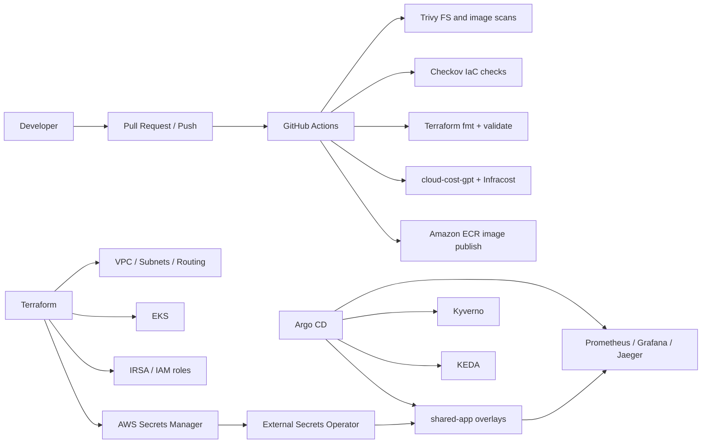

# cloud-native-devsecops

[](https://github.com/YUV3571/cloud-native-devsecops/actions/workflows/ci-cd.yml)
[](https://github.com/YUV3571/cloud-native-devsecops/actions/workflows/codeql.yml)
[](LICENSE)

Production-style DevSecOps platform showcasing GitOps delivery to Amazon EKS, policy enforcement, security scanning, secrets management, cost analysis, KEDA-driven autoscaling inputs, and an observability stack built for platform engineering portfolios.

## Resume Alignment

This repository now credibly demonstrates:

- Terraform-managed AWS networking, EKS, ECR, IRSA, and Secrets Manager integration.
- GitHub Actions pipelines with Trivy, Checkov, Terraform validation, container verification, and CodeQL.
- GitOps application delivery with Argo CD across `dev`, `stage`, and `prod`.
- External Secrets, Kyverno policy scaffolding, KEDA scaler manifests, and monitoring stack definitions.
- AI-assisted cost reporting that combines AWS Cost Explorer data with optional Infracost pull request context.

The original resume project also referenced AKS deployment and fully proven SLO / tracing evidence. Those areas still require live cloud deployment and screenshots before they can be presented as complete proof artifacts.

## Architecture



More detail: [docs/architecture.md](/Users/yuv/Documents/Codex/2026-07-07/you-have-full-access-to-my/cloud-native-devsecops/docs/architecture.md)

## Repository Structure

```text
.
├── .github/workflows/         # CI, security, and static analysis
├── argo-cd-gitops/            # Argo CD Application definitions
├── cloud-cost-gpt/            # AWS Cost Explorer + Infracost cost analysis action
├── docs/                      # Architecture and operating notes
├── keda-openai-scaler/        # KEDA scaling manifest definitions
├── kyverno-policies/          # Admission and verification policies
├── observability-stack/       # Monitoring stack definition
├── platform-secrets/          # External Secrets manifests
├── shared-app/                # Demo workload and Kubernetes manifests
└── terraform-iac/             # AWS infrastructure baseline
```

## Delivery Workflow

1. A change lands through a pull request or direct push.
2. GitHub Actions runs Trivy, Checkov, Terraform validation, Node verification, and CodeQL.
3. On a protected mainline deployment path, the workflow can build and push `shared-app` to ECR.
4. Argo CD detects manifest changes and syncs environment overlays.
5. External Secrets wires runtime secrets from AWS Secrets Manager.
6. Prometheus metrics feed KEDA triggers and Grafana dashboards.
7. `cloud-cost-gpt` can produce a markdown spend report using AWS Cost Explorer and optional Infracost JSON.

## Getting Started

### Infrastructure

```bash
cd terraform-iac
terraform init
terraform fmt -check -recursive
terraform validate
terraform plan
```

### Application

```bash
cd shared-app
npm install
npm start
```

### GitOps

```bash
kubectl apply -f argo-cd-gitops/
```

## Security Controls

- Trivy filesystem scanning in CI.
- Checkov for Terraform scanning.
- CodeQL for code scanning.
- ECR image scanning enabled on push.
- External Secrets + IRSA for runtime secret retrieval.
- Kyverno policy baseline for signed images and hardened pods.

## Cost Optimisation

`cloud-cost-gpt` queries AWS Cost Explorer and can optionally ingest an `infracost.json` file produced earlier in CI. When an OpenAI key is present, it adds a concise AI summary; otherwise it still emits a deterministic markdown report with actionable FinOps guidance.

## Gaps Before Full Resume Proof

- Live EKS and observability deployment evidence is still required.
- AKS parity should be restored only as a maintained Terraform surface, not as stale sample files.
- SLOs, traces, screenshots, and real incident/error-budget examples should be captured from a running environment.
