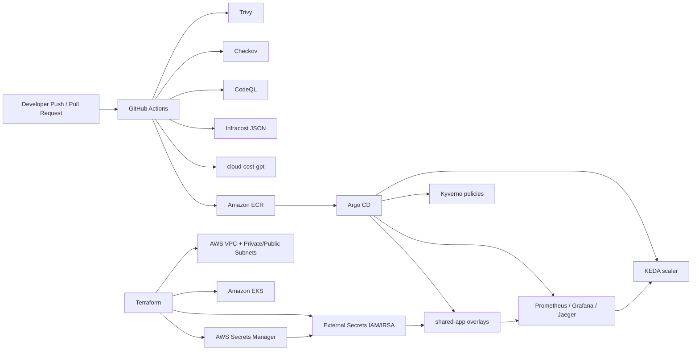

# Architecture

## Scope

- The AWS path in this repository is deployment-ready and validated in CI.
- The AKS half of the original resume project is intentionally not represented as active Terraform here until it can be maintained to the same standard as the EKS path.
- `cloud-cost-gpt` consumes AWS Cost Explorer data and optionally enriches recommendations with Infracost pull request estimates.
